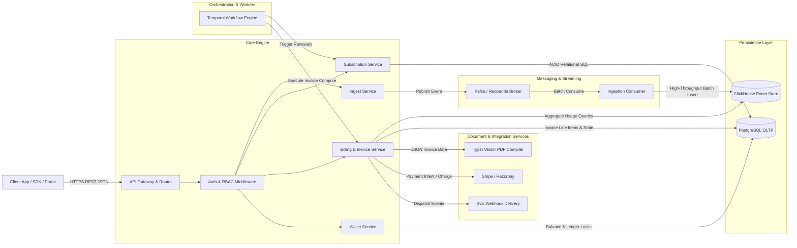

# ARCHITECTURE.md — System Architecture Specification

## 1. Overview
The billing engine rebuild is a distributed, event-driven monetization platform designed for high throughput, strict data consistency, and reliable rating. The system follows an API-first headless microservice architecture where ingest pipelines are isolated from complex rating and invoice computation routines.

---

## 2. Component Architecture & Data Flow

---

## 3. External Services & Dependencies

| External Component | Role & Protocol | Rationale in Rebuild |
| :--- | :--- | :--- |
| **PostgreSQL 17** | Relational OLTP (SQL via GORM / Ent) | Source of truth for ACID transactions: tenants, users, subscriptions, wallets, prices, and invoices. Supports advisory locks and transactional consistency. |
| **ClickHouse 24.9** | Columnar OLAP (ClickHouse Native TCP / HTTP) | Append-only store for high-frequency usage telemetry events. Delivers sub-second aggregate calculations across millions of event rows for bill rating. |
| **Kafka / Watermill** | Distributed Streaming Log | Decouples event ingestion from ClickHouse insertion, absorbing massive traffic spikes with partitioning by `tenant_id` + `customer_id`. |
| **Temporal 1.26** | Workflow & Schedule Orchestration (gRPC) | Coordinates durable, long-running processes: subscription billing cycles, grace-period finalization, and retryable payment sweeps. |
| **Stripe / Razorpay** | Payment Gateway (HTTPS REST) | Collects payments via hosted checkouts or automatic off-session card charges; Flexprice stores gateway transaction IDs without handling raw credit card data. |
| **Svix** | Webhook Dispatch (HTTPS REST) | Enterprise webhook delivery infrastructure providing retry schedules, exponential backoff, and signature verification. |
| **Typst Compiler** | Document Generation Engine (Binary CLI) | Deterministic, high-performance compilation of JSON invoice schemas into crisp, vector-rendered PDF documents. |

---

## 4. Where State Lives

| State Category | Storage Location | Durability & Scope |
| :--- | :--- | :--- |
| **Relational Domain Entities** | **PostgreSQL** (`tenants`, `users`, `plans`, `prices`, `subscriptions`, `wallets`, `invoices`) | Persistent, ACID transactional. Backed by read-committed transactions and advisory locking. |
| **Raw Telemetry Events** | **ClickHouse** (`events` table) | Persistent, immutable append-only. Partitioned by month and indexed by `(tenant_id, event_name, customer_id, timestamp)`. |
| **Streaming Queue State** | **Kafka Message Topics** (`events`, `raw_events`) | Persistent log with retention policy (e.g. 7 days). Provides at-least-once delivery guarantees. |
| **Workflow State** | **Temporal Cluster** (Postgres/Cassandra backend) | Resilient event-sourced state machines tracking active subscription billing periods and retry timers. |
| **Real-time Balance Cache** | **Redis** | Ephemeral cache (TTL: 60s) for rapid wallet balance lookups; invalidates immediately upon new credit/debit operations. |
| **Client Session Tokens** | **Browser / Client Memory** | Ephemeral JWT or portal session bearer tokens carrying customer identity and tenant scope. |

---

## 5. Key Architecture Decisions & Rationales

1. **Synchronous Broker Acknowledgement for Ingest API**:
   - *Decision*: `POST /v1/events` only returns `202 Accepted` after the message broker (Kafka) confirms receipt (`acks=all` or partition ack).
   - *Rationale*: Eliminates the original bug where broker write failures were swallowed, causing unrecoverable data loss and unbilled customer usage.
2. **Unified Default-Deny RBAC on All Routes**:
   - *Decision*: Read endpoints must require `read(types.Entity, types.ActionRead)` instead of leaving query endpoints unprotected.
   - *Rationale*: Prevents service accounts with narrow privileges (e.g. `event_ingestor`) from enumerating all customer data, invoices, and balances.
3. **Idempotency & Advisory Locking on Subscriptions**:
   - *Decision*: Subscriptions require unique constraints on `(tenant_id, environment_id, customer_id, plan_id)` for active status, alongside PostgreSQL advisory locks on customer ID during creation.
   - *Rationale*: Prevents race conditions from network retries and double-clicks that spawn parallel subscriptions, duplicate invoices, and colliding Temporal renewal workflows.
4. **Isolated Customer Portal Session Model**:
   - *Decision*: Portal routes authenticate exclusively via Customer Portal Session Tokens and never evaluate API-key RBAC roles.
   - *Rationale*: Fixes the architectural defect where customer self-service updates (`PUT /v1/customer/portal/info`) failed with 403 Forbidden because portal tokens intentionally carry no staff roles.
5. **Decoupled Frontend Repository**:
   - *Decision*: Maintain core engine purely as a headless API service, interfacing with `flexprice-front` via standard REST JSON.
   - *Rationale*: Keeps the Go backend lean, containerized, and optimized for compute-heavy rating without bloating container images with Node/Vite build chains.
