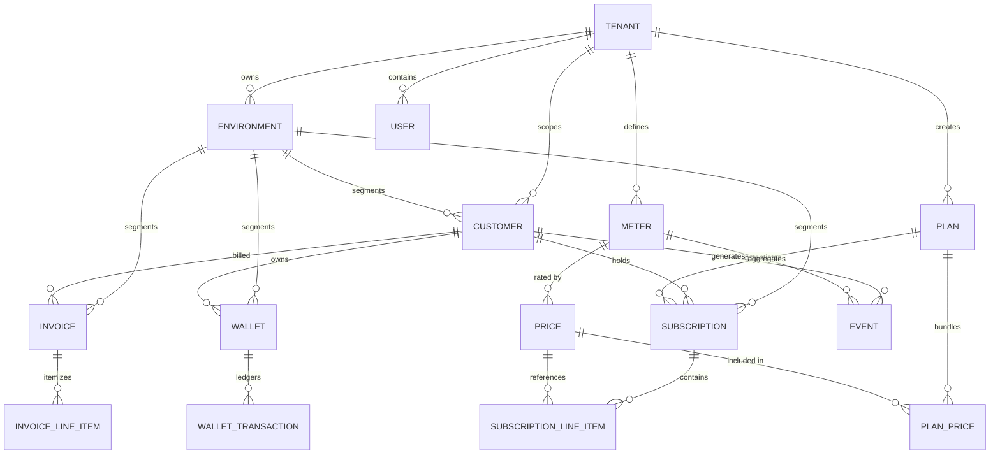

# DATA_MODEL.md — Data Model & Schema Specification

## 1. Entity-Relationship Overview



---

## 2. Relational Entity Definitions (PostgreSQL)

### 2.1 `tenants`
- **Purpose**: Root organization and multi-tenant boundary.
- **Fields**:
  - `id` (VARCHAR(50), PK): Unique tenant identifier (prefix `tenant_`).
  - `name` (VARCHAR(255), NOT NULL): Organization display name.
  - `status` (VARCHAR(50), NOT NULL): `published`, `archived`, `suspended`.
  - `created_at` (TIMESTAMPTZ, NOT NULL), `updated_at` (TIMESTAMPTZ, NOT NULL).
- **Constraints**: PK (`id`).

### 2.2 `users`
- **Purpose**: Dashboard users and administrative operators.
- **Fields**:
  - `id` (VARCHAR(50), PK): User ID (prefix `user_`).
  - `tenant_id` (VARCHAR(50), NOT NULL, FK -> tenants.id).
  - `email` (VARCHAR(255), NOT NULL).
  - `password_hash` (VARCHAR(255), NULL): Bcrypt encrypted password.
  - `role` (VARCHAR(50), NOT NULL): `super_admin`, `all_reader`, `all_writer`.
  - `created_at` (TIMESTAMPTZ, NOT NULL), `updated_at` (TIMESTAMPTZ, NOT NULL).
- **Constraints**: PK (`id`), Unique (`tenant_id`, `email`).

### 2.3 `customers`
- **Purpose**: B2B accounts receiving subscriptions, invoices, and wallets.
- **Fields**:
  - `id` (VARCHAR(50), PK): Customer ID (prefix `cust_`).
  - `tenant_id` (VARCHAR(50), NOT NULL, FK -> tenants.id).
  - `environment_id` (VARCHAR(50), NOT NULL).
  - `external_id` (VARCHAR(255), NOT NULL): Caller-defined external identifier.
  - `name` (VARCHAR(255), NOT NULL): Customer name.
  - `email` (VARCHAR(255), NOT NULL): Primary billing email.
  - `currency` (VARCHAR(10), NOT NULL): Three-letter ISO currency (e.g. `USD`).
  - `address_line1`, `address_city`, `address_state`, `address_postal_code`, `address_country` (VARCHAR, NULL).
  - `status` (VARCHAR(50), NOT NULL): `published`, `archived`.
- **Constraints**: PK (`id`), Unique (`tenant_id`, `environment_id`, `external_id`).

### 2.4 `meters`
- **Purpose**: Aggregation formula for telemetry consumption events.
- **Fields**:
  - `id` (VARCHAR(50), PK): Meter ID (prefix `meter_`).
  - `tenant_id` (VARCHAR(50), NOT NULL).
  - `environment_id` (VARCHAR(50), NOT NULL).
  - `name` (VARCHAR(255), NOT NULL): Display name.
  - `event_name` (VARCHAR(255), NOT NULL): Target ClickHouse `event_name`.
  - `aggregation_type` (VARCHAR(50), NOT NULL): `COUNT`, `SUM`, `AVG`, `MAX`, `LATEST`.
  - `value_property` (VARCHAR(255), NULL): JSON property to aggregate.
  - `filters` (JSONB, NULL): Attribute match rules.
  - `status` (VARCHAR(50), NOT NULL): `published`, `archived`.
- **Constraints**: PK (`id`), Index (`tenant_id`, `environment_id`, `event_name`).

### 2.5 `prices`
- **Purpose**: Unit economics and charge models.
- **Fields**:
  - `id` (VARCHAR(50), PK): Price ID (prefix `price_`).
  - `tenant_id` (VARCHAR(50), NOT NULL).
  - `environment_id` (VARCHAR(50), NOT NULL).
  - `meter_id` (VARCHAR(50), NULL, FK -> meters.id).
  - `currency` (VARCHAR(10), NOT NULL).
  - `type` (VARCHAR(50), NOT NULL): `USAGE`, `FIXED`, `SEAT`.
  - `billing_model` (VARCHAR(50), NOT NULL): `FLAT_FEE`, `PACKAGE`, `TIERED_GRADUATED`, `TIERED_VOLUME`.
  - `billing_period` (VARCHAR(50), NOT NULL): `MONTHLY`, `ANNUAL`, `WEEKLY`.
  - `tier_mode` (VARCHAR(50), NULL): Graduated or Volume.
  - `tiers` (JSONB, NULL): Array of tier brackets (`up_to`, `unit_amount`, `flat_amount`).
  - `status` (VARCHAR(50), NOT NULL): `published`, `archived`.
- **Constraints**: PK (`id`).

### 2.6 `plans`
- **Purpose**: Commercial packages combining base prices and usage meters.
- **Fields**:
  - `id` (VARCHAR(50), PK): Plan ID (prefix `plan_`).
  - `tenant_id` (VARCHAR(50), NOT NULL).
  - `environment_id` (VARCHAR(50), NOT NULL).
  - `name` (VARCHAR(255), NOT NULL): Plan name (e.g. "Pro Tier").
  - `lookup_key` (VARCHAR(255), NULL): API reference lookup identifier.
  - `status` (VARCHAR(50), NOT NULL): `published`, `archived`.
- **Constraints**: PK (`id`), Unique (`tenant_id`, `environment_id`, `lookup_key`).

### 2.7 `subscriptions`
- **Purpose**: Active contract between customer and plan.
- **Fields**:
  - `id` (VARCHAR(50), PK): Subscription ID (prefix `sub_`).
  - `tenant_id` (VARCHAR(50), NOT NULL).
  - `environment_id` (VARCHAR(50), NOT NULL).
  - `customer_id` (VARCHAR(50), NOT NULL, FK -> customers.id).
  - `plan_id` (VARCHAR(50), NOT NULL, FK -> plans.id).
  - `subscription_status` (VARCHAR(50), NOT NULL): `draft`, `active`, `paused`, `cancelled`.
  - `currency` (VARCHAR(10), NOT NULL).
  - `billing_cycle` (VARCHAR(50), NOT NULL): `anniversary`, `calendar`.
  - `billing_period` (VARCHAR(50), NOT NULL): `month`, `year`.
  - `current_period_start` (TIMESTAMPTZ, NOT NULL).
  - `current_period_end` (TIMESTAMPTZ, NOT NULL).
  - `cancel_at_period_end` (BOOLEAN, DEFAULT FALSE).
  - `idempotency_key` (VARCHAR(100), NULL).
- **Constraints**:
  - PK (`id`).
  - Partial Unique Index (`tenant_id`, `environment_id`, `customer_id`, `plan_id`) WHERE `subscription_status = 'active'` (prevents duplicate active subscriptions).
  - Unique Index (`tenant_id`, `environment_id`, `idempotency_key`) WHERE `idempotency_key IS NOT NULL`.

### 2.8 `subscription_line_items`
- **Purpose**: Concrete prices associated with an individual subscription.
- **Fields**:
  - `id` (VARCHAR(50), PK): Line item ID.
  - `subscription_id` (VARCHAR(50), NOT NULL, FK -> subscriptions.id).
  - `price_id` (VARCHAR(50), NOT NULL, FK -> prices.id).
  - `meter_id` (VARCHAR(50), NULL, FK -> meters.id).
  - `quantity` (NUMERIC(20,8), DEFAULT 0).
  - `status` (VARCHAR(50), NOT NULL): `published`, `archived`.
- **Constraints**: PK (`id`), Index (`subscription_id`).

### 2.9 `wallets` & `wallet_transactions`
- **Purpose**: Customer prepaid credit balances and auditable ledgers.
- **Fields (`wallets`)**:
  - `id` (VARCHAR(50), PK): Wallet ID (prefix `wallet_`).
  - `tenant_id`, `environment_id` (VARCHAR(50), NOT NULL).
  - `customer_id` (VARCHAR(50), NOT NULL, FK -> customers.id).
  - `currency` (VARCHAR(10), NOT NULL).
  - `balance` (NUMERIC(20,8), NOT NULL, DEFAULT 0): Currency balance.
  - `credit_balance` (NUMERIC(20,8), NOT NULL, DEFAULT 0): Credit balance.
  - `conversion_rate` (NUMERIC(20,8), NOT NULL, DEFAULT 1.0).
  - `wallet_status` (VARCHAR(50), NOT NULL): `active`, `closed`.
- **Fields (`wallet_transactions`)**:
  - `id` (VARCHAR(50), PK): Transaction ID.
  - `wallet_id` (VARCHAR(50), NOT NULL, FK -> wallets.id).
  - `type` (VARCHAR(50), NOT NULL): `CREDIT`, `DEBIT`.
  - `amount` (NUMERIC(20,8), NOT NULL): Currency value.
  - `credit_amount` (NUMERIC(20,8), NOT NULL): Credit units.
  - `credits_available` (NUMERIC(20,8), NOT NULL, DEFAULT 0): Unspent balance on credit transactions.
  - `transaction_reason` (VARCHAR(50), NOT NULL).
  - `idempotency_key` (VARCHAR(100), NULL).
  - `created_at` (TIMESTAMPTZ, NOT NULL).
- **Constraints**: PK (`id`), Unique (`wallet_id`, `idempotency_key`).

### 2.10 `invoices` & `invoice_line_items`
- **Purpose**: Itemized customer billing statements.
- **Fields (`invoices`)**:
  - `id` (VARCHAR(50), PK): Invoice ID (prefix `inv_`).
  - `tenant_id`, `environment_id` (VARCHAR(50), NOT NULL).
  - `customer_id` (VARCHAR(50), NOT NULL, FK -> customers.id).
  - `subscription_id` (VARCHAR(50), NULL, FK -> subscriptions.id).
  - `invoice_type` (VARCHAR(50), NOT NULL): `SUBSCRIPTION`, `ONE_OFF`, `CREDIT`.
  - `invoice_status` (VARCHAR(50), NOT NULL): `DRAFT`, `FINALIZED`, `VOIDED`.
  - `payment_status` (VARCHAR(50), NOT NULL): `PENDING`, `PAID`, `FAILED`.
  - `currency` (VARCHAR(10), NOT NULL).
  - `amount_due` (NUMERIC(20,8), NOT NULL).
  - `amount_paid` (NUMERIC(20,8), NOT NULL, DEFAULT 0).
  - `amount_remaining` (NUMERIC(20,8), NOT NULL).
  - `period_start`, `period_end`, `due_date`, `paid_at`, `finalized_at` (TIMESTAMPTZ, NULL).
- **Constraints**: PK (`id`), Index (`tenant_id`, `environment_id`, `customer_id`, `invoice_status`).

---

## 3. High-Throughput Event Schema (ClickHouse)

```sql
CREATE TABLE events (
    id UUID,
    tenant_id LowCardinality(String),
    environment_id LowCardinality(String),
    event_name LowCardinality(String),
    customer_id String,
    timestamp DateTime64(3, 'UTC'),
    properties String CODEC(ZSTD),
    created_at DateTime DEFAULT now()
) ENGINE = ReplacingMergeTree()
PARTITION BY toYYYYMM(timestamp)
PRIMARY KEY (tenant_id, environment_id, event_name, customer_id, timestamp, id)
ORDER BY (tenant_id, environment_id, event_name, customer_id, timestamp, id);
```
